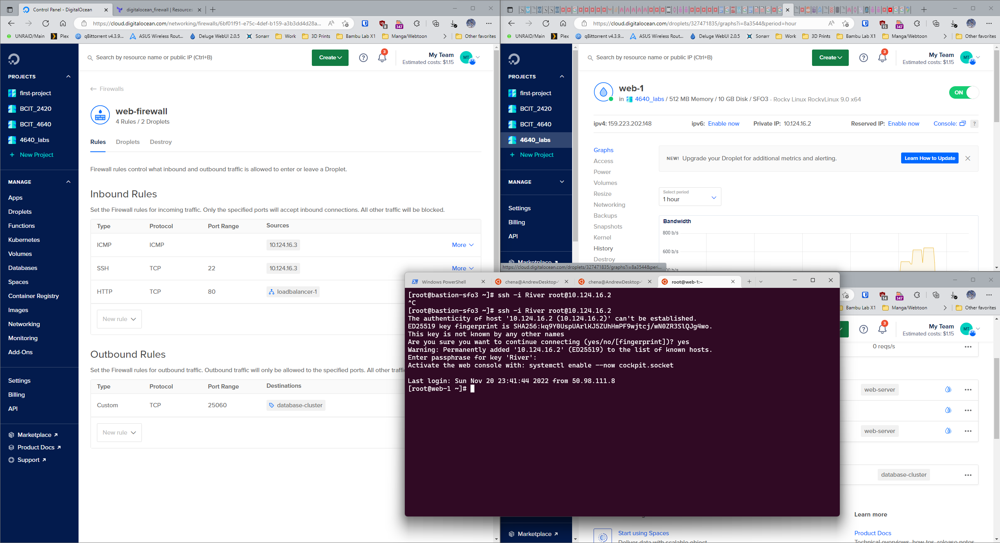
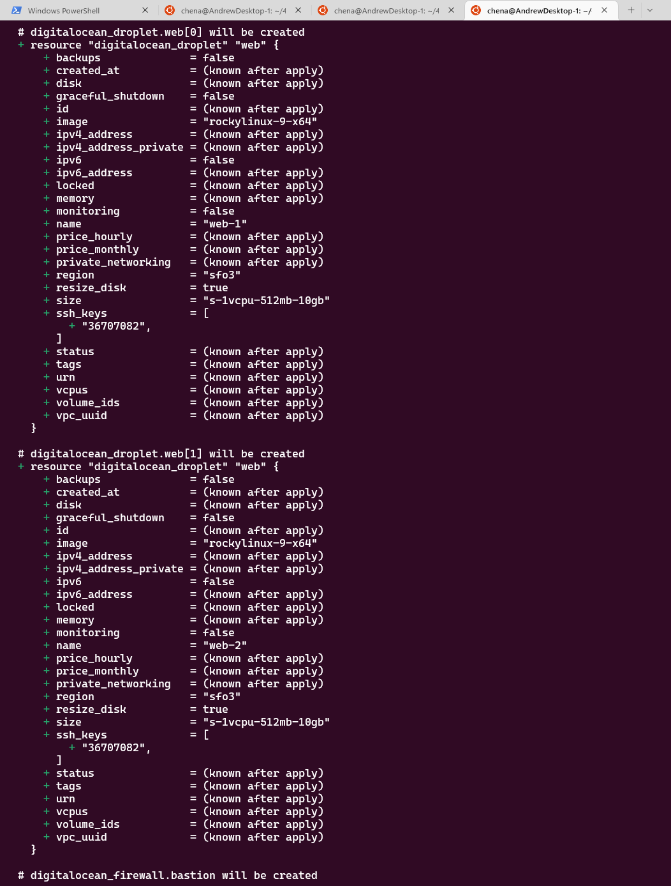

# 4640-assign

# This operates assuming the ssh key "River" is being used and that a project named "4640_labs" was created.
1. This assumes the key is called River and can either be found in the .ssh or in the current directory.
2. The project name can be set under "data.tf" line 10 changing it from "name = "4640_labs"" to "name = <Insert project name here>"

# If the ssh key name may need to be changed:
1. go to line 5 of "data.tf" change "name = "River"" to "name = <Insert key name here>"

# .env file creation should contain the following if you want to use environment variables to store the do_token
1. the .env file should contain the following:
export TF_VAR_do_token=<Insert token here>
2. use the command "source .env" to add the variable to the environment

# If wanting to set API key or other variables using terraform.tfvars.
1. Make a terraform.tfvars and enter the following optional values if you would like to make changes:
Example:
do_token="<Insert digital ocean api key here>" 
region="<Insert Region Here>"
droplet_count="<Insert Number of Web servers here>"

# Instructions for running the terraform
This should create and run 2 droplets tagged "web-server" within the same VPC running rocky linux.

1. run terraform init
2. run terraform apply once all the above is completed
3. It will ask for an API key from digital ocean if you haven't sourced the .env or set terraform.tfvars
4. Once entered it will create the web servers, load balancer, postgres database cluster, and their accompanying firewalls.

# Project Resources should appear as below when completed
Resources created when project created.

# Database Connection Image
Image demonstrating was able to connect to database without database firewall

# Bastion to web-server SSH Connection Image
Images demonstrating successful connection to web servers from bastion
Also shows the Firewall settings and the private IP having been assigned automatically.
Database enabled using tags as it doesn't have an option for IP and only allows hostname attribute retrieval

# Terraform Apply Images
The following are screenshots of terraform apply:

# Bastion Firewall
Firewall settings for bastion

# Output

